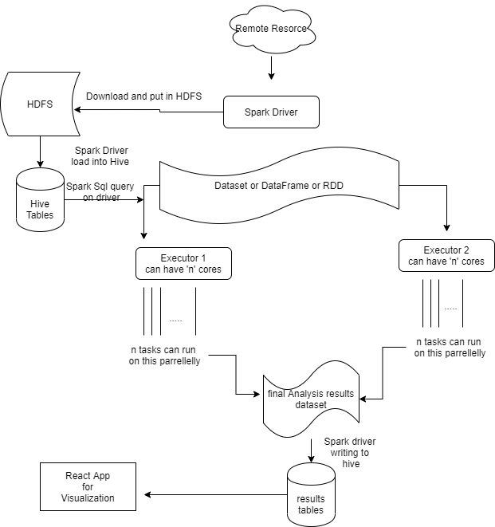

# flow diagram

# 1.install hadoop :(i did at C:/apps)
https://hadoop.apache.org/releases.html

cd C:\apps\hadoop\etc\hadoop

update below files config as below.
core-site.xml: security settings and file system ase location configuration as below.
<configuration>
   <property>
       <name>fs.defaultFS</name>
       <value>hdfs://localhost:9000</value>
   </property>
   <property>
      <name>hadoop.proxyuser.username.groups</name>
      <value>*</value>
   </property>
   <property>
     <name>hadoop.proxyuser.username.hosts</name>
     <value>*</value>
   </property>
</configuration>

hdfs-site.xml: minimum replication , Data node and name node locations.
<configuration>
   <property>
       <name>dfs.replication</name>
       <value>1</value>
   </property>
   <property>
       <name>dfs.namenode.name.dir</name>
       <value>C:\apps\hadoop\data\namenode</value>
   </property>
   <property>
       <name>dfs.datanode.data.dir</name>
       <value>F:\dnd</value>
   </property>
</configuration>

hive-site.xml: hive warehouse location(can be overriten by spark context),metastore db (mysql) settings.
<configuration>
  <property>
	<name>hive.server2.enable.doAs</name>
	<value>FALSE</value>
	<description>
		Setting this property to true will have HiveServer2 execute
		Hive operations as the user making the calls to it.
	</description>
   </property> 
    <property>
        <name>hive.metastore.warehouse.dir</name>
        <value>hdfs://localhost:9000/hive-warehouse</value>
      </property>

    <property>
      <name>javax.jdo.option.ConnectionURL</name>
      <value>jdbc:mysql://localhost:3306/hivedb?createDatabaseIfNotExist=true</value>
    </property>
	
    <property>
      <name>javax.jdo.option.ConnectionDriverName</name>
      <value>com.mysql.cj.jdbc.Driver</value>
    </property>
    <property>
      <name>javax.jdo.option.ConnectionUserName</name>
      <value>root</value>
    </property>
    <property>
      <name>javax.jdo.option.ConnectionPassword</name>
      <value>hive</value>
    </property>
	
	<property>
	  <name>datanucleus.autoCreateSchema</name>
	  <value>true</value>
	</property>

	<property>
	  <name>datanucleus.fixedDatastore</name>
	  <value>true</value>
	</property>

	<property>
	 <name>datanucleus.autoCreateTables</name>
	 <value>True</value>
	</property>
</configuration>

Then format name node to reset every thing, then start hdfs file system:
/hadoop/bin/hadoop.cmd namenode -format 
/hadoop/sbin/start-dfs.cmd

#### hive setup ###
cd C:/apps/hadoop/hive
/bin/schematool -dbType mysql -initSchema  ## create hivedb, tables in mysql server.
then start metastore srevice, hiveserver2
/bin/hive --service metastore
/bin/hiveserver2 start
then to verify you can connect using beeline
/bin/beeline
## can login with any user name and password as we set * core-site.xml and hive.server2.enable.doAs value FALSE .
!connect jdbc:hive2://localhost:10000/default

### start the program ####
# Intellij
to run from intellij, add SPARK_HOME/jars as library to module. and add core-site.xml,hdfs-site.xml,hive-site.xml and mysql-connector.jar in classpath.
and select add provide scope dependecies in class path.
# spark submit for windows:
clone repository.
cd spark-app
mvn clean install
then follow below steps.
to run spark program we need spark , hadoop and hive dependencies should be available for both Driver and executor.
spark submit command provides us way to copy and depencies to class path of container.

if PATH not have spark and hadoop library , please add them.

set PATH=%PATH%;C:\apps\spark-2.4.5\jars;
C:\apps\spark-2.4.5\bin\spark-submit ^ \
  --class com.mdb.sample.Analyser ^ \
  --master local[*] ^ \
  --files "C:\\apps\\hadoop\\etc\\hadoop\\hive-site.xml,C:\\apps\\hadoop\\etc\\hadoop\\core-site.xml,C:\\apps\\hadoop\\etc\\hadoop\\hdfs-site.xml,C:\\Users\\veera\\Desktop\\sparkapp\\configuration\\application.properties" ^ \
  --driver-class-path "C:\\Users\\veera\\Desktop\\configuration\\mysql-connector-java-8.0.19.jar" ^ \
  --jars "C:\\apps\\hadoop\\etc\\hadoop\\hive-site.xml,C:\\apps\\hadoop\\etc\\hadoop\\core-site.xml,C:\\apps\\hadoop\\etc\\hadoop\\hdfs-site.xml,C:\\Users\\veera\\Desktop\\sparkapp\\configuration\\application.properties,C:\\Users\\veera\\Desktop\\sparkapp\\configuration\\mysql-connector-java-8.0.19.jar" ^ \
spark-app.jar https://chronicdata.cdc.gov/views/735e-byxc/rows.csv?accessType=DOWNLOAD

for yarn mode , please add executors configuration to work. like --executor-memory ,--number of executors, --executor-cores etc.

for linux replace "^" with "/" and replace path as per dependencies location.

